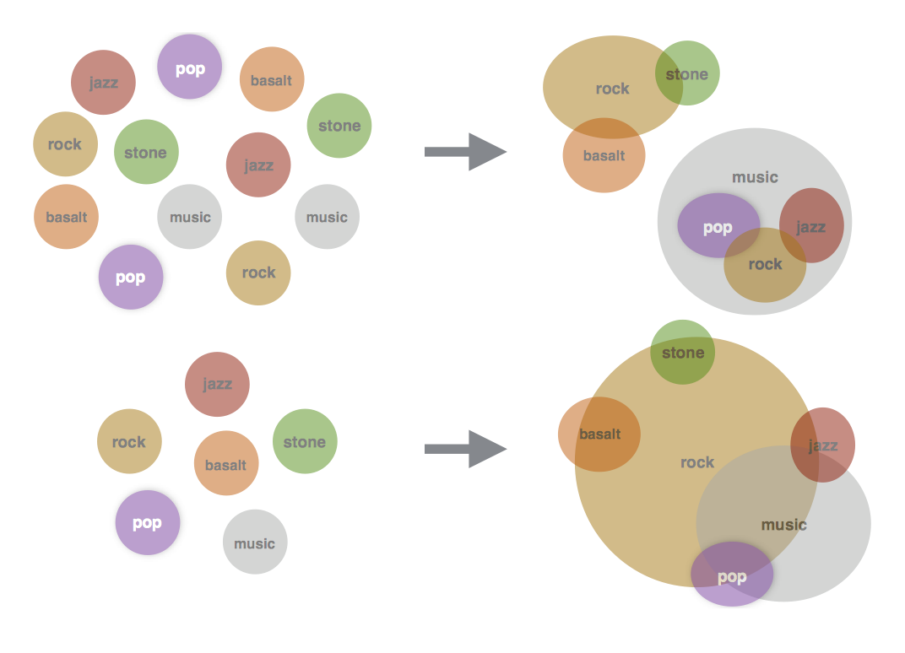

# Multimodal Word Distributions

* Abstract 摘要

## 1. Introduction
 

## 2. Related Work

## 3. Methodology

### 3.1 Word Representation

### 3.2 Skip-Gram
训练对象的学习参数$\theta =\left \{ \overrightarrow{u_{w,i}}, p_{w,i}, \sum{_{w,i}}  \right \}$ 的想法来自于连续skip-gram模型(Mikolov et al., 2013a), 在skip-gram模型中训练单词嵌入（word embedings)的目的是为了最大化一个单词与其相邻单词的概率。这个过程遵循了在自然语境中单词的出现是语义相关的这样一种分布式假设。举例：单词'jazz'和'music'出现的趋势会比'jazz'和'cat'出现的趋势更平常。因此'jazz'和'music'更有可能相关。单词表示的学习包含useful semantic information和可以用来执行自然语言处理的各种任务。例如，单词的相似性分析，语义分类，单词类比建模或者作为一个复杂系统（统计机器翻译）的预处理输入。

上面的Figure 1 是一个高斯混合嵌入的模型，每一个组件都关联一个不同的意思，每一个高斯组件表示为一个椭圆形，椭圆形的中心是均值向量，表面的值线表示协方差矩阵，这个矩阵反应了均值和不确定性的微妙变化。图的左半部分是单词的高斯混合分布，在这个分布中高斯组件随机地初始化。训练之后，在图的右侧可以看到单词'rock'组件更加接近于'stone' 和'basalt', 其他高斯组件也有同样的现象:'music'更接近于'jazz'和'pop'。同时也证明了逻辑蕴含的概念，在逻辑蕴含中更一般化的单词'music'就会被'jazz', 'pop', 'rock'这些单词修饰。在图的下面是高斯嵌入模型（Vilnis and McCallum, 2014)。单词具有多层意思，比如'rock', 学习表示的方差没必要地变大就是为了给其他含义分配一些概率。此外，这些词的均值向量可以在两个聚类之间进行，将分布的质量集中在远离某些含义的区域上。

### 3.3 Energy-based Max-Margin Objective
对象中的每个实例都包含两对单词，$\left ( w, c \right )$ 和 $\left (w, {c}' \right )$

## 4. Experiments

### 4.1 Hyperparameters

### 4.2 Similarity Measures

#### 4.2.1 Expected Likelihood Kernel

#### 4.2.2 Maximum Cosine Similarity

#### 4.2.3 Minimum Euclidean Distance

### 4.3 Qualitative Evaluation

### 4.4 Word Similarity

### 4.5 Word Similarity for Polysemous Words

### 4..6 Reduction in Variance of Polysemous Words

### 4.7 Word Entailment
 

## 5 Discussion

