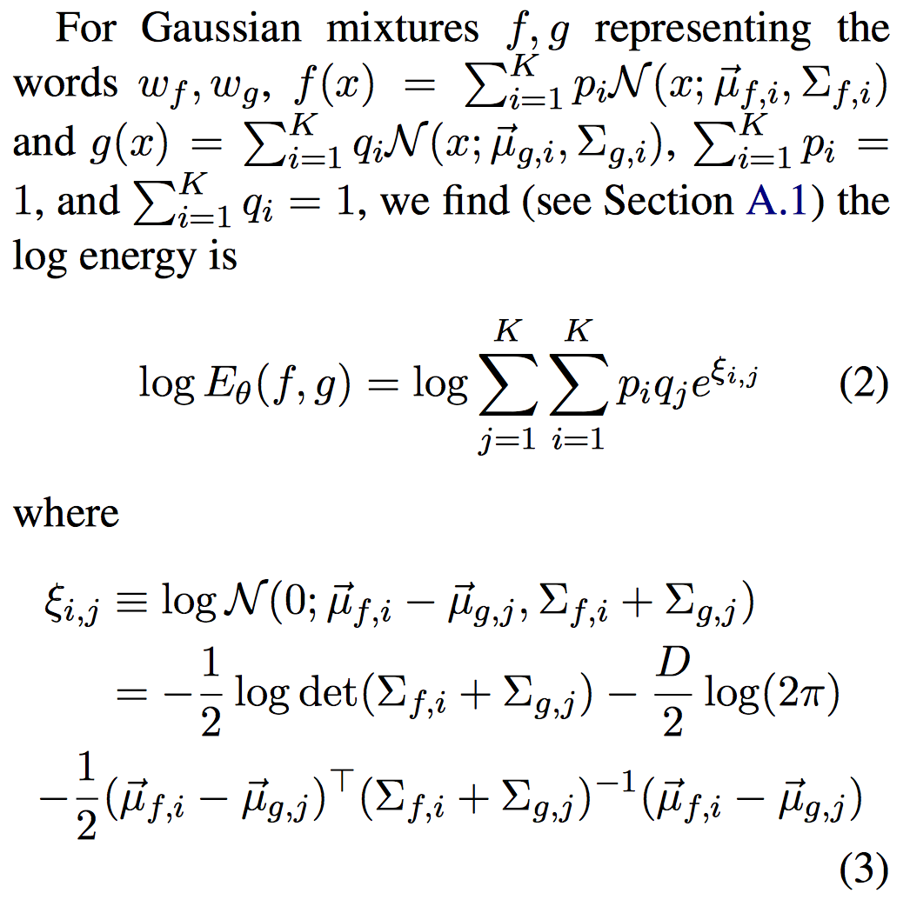

# Multimodal Word Distributions

* Abstract 摘要

## 1. Introduction
 

## 2. Related Work

## 3. Methodology

### 3.1 Word Representation

### 3.2 Skip-Gram
训练对象的学习参数$\theta = \lbrace {\overrightarrow{u_{w,i}}, p_{w,i}, \sum{_{w,i}} \rbrace }$ 的想法来自于连续skip-gram模型(Mikolov et al., 2013a), 在skip-gram模型中训练单词嵌入（word embedings)的目的是为了最大化一个单词与其相邻单词的概率。这个过程遵循了在自然语境中单词的出现是语义相关的这样一种分布式假设。举例：单词'jazz'和'music'出现的趋势会比'jazz'和'cat'出现的趋势更平常。因此'jazz'和'music'更有可能相关。单词表示的学习包含useful semantic information和可以用来执行自然语言处理的各种任务。例如，单词的相似性分析，语义分类，单词类比建模或者作为一个复杂系统（统计机器翻译）的预处理输入。

上面的Figure 1 是一个高斯混合嵌入的模型，每一个组件都关联一个不同的意思，每一个高斯组件表示为一个椭圆形，椭圆形的中心是均值向量，表面的值线表示协方差矩阵，这个矩阵反应了均值和不确定性的微妙变化。图的左半部分是单词的高斯混合分布，在这个分布中高斯组件随机地初始化。训练之后，在图的右侧可以看到单词'rock'组件更加接近于'stone' 和'basalt', 其他高斯组件也有同样的现象:'music'更接近于'jazz'和'pop'。同时也证明了逻辑蕴含的概念，在逻辑蕴含中更一般化的单词'music'就会被'jazz', 'pop', 'rock'这些单词修饰。在图的下面是高斯嵌入模型（Vilnis and McCallum, 2014)。单词具有多层意思，比如'rock', 学习表示的方差没必要地变大就是为了给其他含义分配一些概率。此外，这些词的均值向量可以在两个聚类之间进行，将分布的质量集中在远离某些含义的区域上。

### 3.3 Energy-based Max-Margin Objective
对象中的每个实例都包含两对单词，$\left ( w, c \right )$ 和 $\left (w, {c}' \right )$, $w$是从语料的句子中抽样的，$c$是距离这个单词长度为$l$的上下文中的单词。举例：单词$w$=jazz在句子 "I listen to the jazz music"的上下文单词有： I, listen, to, music。${c}'$是随机抽取的非上下问单词，例如 ${c}'$ = ariplane。

我们的目标是最大化单词$w$和$c$出现的energy（注：文章中是energy，以我的思维翻译为概率，但是作者没有用概率哪个单词，而是用了这个。）, 最小化$w$和${c}'$出现的energy。这个过程和负抽样（negative sampling Mikolov el al., 2013a, b)很相似, 通过对比正上下文对和负上下文对之间的点积。energy函数是对分布和3.4节中讨论的内容的相似性的度量。

我们使用了 max-margin 排序目标（Joachims, 2002),这在Vilnis和McCallum（2014）的高斯嵌入中使用了这种方法。通过计算m可以使得一个单词的正上下文语境的相似性高于负上下文语境的相似性。

$$L_{\theta}(w,c,{c}') = max(0, m-logE_\theta(w,c) + logE_\theta(w,{c}'))$$

关于$\theta=\{\overrightarrow{u_{w,i}},p_{w,i}, \sum_{w,i} \}$的随机梯度下降算法可以最小化上面的$L_{\theta}$。

**单词采样** 用和word2vec（Mikolov, et al., 2013a,b)的实现很相似的单词采样来平衡frequent words和rare words的重要性。Frequent words比如 'the', 'a', 'to'，这些单词相对于frequent word 'dog', 'love', 'rock'这些单词没有太大的意义，有时候可能更加关注出现频率较少的具有语义的单词。我们使用子采样来改善学习单词向量的性能（Mikolov et al., 2013b). 这里对单词$w_{i}$以$P(w_{i})=1-\sqrt(t/fw_{i})$, 公式中$f(w_{i})$是单词$w_{i}$在训练预料中国呢出现的次数，$t$是一个频率的阈值。

为了产生负上下文单词，每个单词$w_{i}$输入后根据分布$P_{n}\propto U(w_{i})^{3/4}$， 这是一个均匀分布的扭曲的版本，经常被用来消除frequent words的相对重要性。 子采样和负分布的选择在word2vec中都被证明是有效的。

### 3.4 Energy Function

在相似性计算（energy function)中，单词经常被表示为向量，相似性的计算就表示为两个向量的点积。 我们的用单词的分布来代替向量，因此我们需要一种度量，这种度量不仅要体现相似性，还要体现无关性。

我们提出了使用 expected likelihood kernel.它是向量之间的内机的分布之间的内积，是对（jebara et al., 2004)的一个扩展。

$$ E(f,g)=\int{f(x)g(x)dx} = <f,g>L_{2}$$

公式中$<.,.>L_{2}$表示Hilbert空间$L_{2}$的内积。我们选择这种形式的energy主要是因为它可以用接近的形式进行评估，由于我们在公式（1）中概率嵌入的选择。

## 4. Experiments

### 4.1 Hyperparameters

### 4.2 相似度量

由于对于每个单词来说，我们的词嵌入包含了多个向量和不确定参数，所以我们用以下的度量来阐述词与词之间的相似性分数。这些度量选出了与最大相似度相匹配的那部分，也因此指出了那些最相关的意义。

#### 4.2.1 期望可能性内核（Expected LikeLihood Kernel）

对于相似性打分来说，一个自然的选择就是期望可能性内核——不同分布的内积，3.4部分中给出。 该度量结合了来自协方差矩阵的不确定性和均值向量间的相似性。

#### 4.2.2 最大余弦相似度（Maximum Cosine Similarity）

这个度量衡量了分布 *f* 和 *g* 中所有成对混合分量的均值向量的相似性。也就是
\\(d(f,g)=\max\_{i,j=1,...,K}\frac{\langle\mu\_{f,i},\mu\_{g,j}\rangle}{\Vert\mu\_{f,i}\Vert\cdot\Vert\mu\_{g,j}\Vert}\\),这个和 *f* 与 *g* 最相似部分的匹配相一致。对于高斯嵌入，最大相似度减小到一般余弦相似度（the usual cosine similarity）。

表1：基于高斯分量的均值向量的余弦相似性的最近的相邻部分：高斯混合嵌入（上），高斯嵌入（下）。表达式 w：i 表示单词 w 的\\(i^{th}\\)混合分量。

#### 4.2.3 最小欧式距离

在评估嵌入时余弦相似性很常用。但是，在等式（3）中我们的训练目标和欧氏距离直接相关，与例如word2vec中的向量点积相反。因此，我们也考虑了欧式度量：\\(d(f,g)=\min\_{i,j=1,...,K}[\Vert\mu\_{f,i}\Vert-\Vert\mu\_{g,j}\Vert]\\)

### 4.3 定性评价

在表1中，我们展示了多义词和他们在嵌入空间中的相领词语的例子，证明了我们的词嵌入训练方法可以捕捉到不同的词义。例如，一个单词比如rock既可能表示stone也可能是rock music，它的每个意思应该用不同的高斯分量表示。我们混合两个高斯模型后得到的结果证实了这个假设，这里我们可以看到rock的\\(0^{th}\\)个分量与（basalt, boulders）有关，而\\(1^{th}\\)个分量与（indie， funk， hip-hop）有关。同样的，单词bank的\\(0^{th}\\)分量代表了河岸，\\(1^{th}\\)分量代表了金融银行。

相反的，在表1（下）中，可以看见对于单一混合分量的高斯嵌入，多义词的最近邻居显著的只与一个意义有关。例如，rock的邻居主要与摇滚乐有关，bank则主要和金融银行有关。这些多义词的可供选择的意义并没有在词嵌入中很好的体现出来。从数值的例子上来看，rock和stone在 Vilnis and McCallum (2014) 中的高斯表示中余弦相似度为0.029，远远低于本篇文章中rock的\\(0^{th}\\)分量，其与stone的余弦相似度为0.586。

在那些单词仅有一个流行的意义的案例中，那些混合分量会相当接近。例如，stone的一个分量与（stones, stonework, slab）接近，其他分量与（carving, relic, excavated）接近，这些（单词）在意思上仅有细微的区别。总的来说，混合能够给出很多特性，比如重尾（重尾分布？）
和比单一高斯模型能描述的更多的不确定的有趣的单峰特征。

**嵌入可视化（Embedding Visualization）** 我们提供了一个交互式的可视化作为代码库的一部分：[https://github.com/benathi/word2gm#visualization](https://github.com/benathi/word2gm#visualization)，这允许实时搜索单词\\(K=1,2,3\\)分量的最近邻居（在embeddings标签中）。我们采用和表1中类似的符号，w:i表示单词 w 的第 i 分量。例如，当\\(K=2\\)时，我们搜寻 bank:0，会发现最近的邻居比如 river:1, confluence:0, waterway:1，这些暗示了bank的\\(0^(th)\\)分量有 river bank 的意思。另一方面，搜寻 bank:1 会得到例如 banking:1, banker:0, ATM:0，表示这一分量与 financial bank 接近。在\\(K=1\\)链接的比较中，我们同样有一个单峰（w2g）的可视化。

另外，我们\\(K=3\\)混合分量的高斯模型的嵌入链接可以学习三个不同的含义。例如，cell有三个分量，分别和（keypad, digits）、（incarcerated, inmate）和（tissue, antibody）接近，分别表示 cellphone, jail cell, biological cell。由于拥有2个以上含义的单词不多，数量上的限制使得在我们的模型中\\(K=3\\)和\\(K=2\\)并没有多大差别。因此，为了简洁，我们不在更多展示\\(K=3\\)的结果。

### 4.4 单词相似性

我们在几个标准单词相似性数据集上评估了我们的词嵌入，它们的名字是，SimLex(Hill et al., 2014), WS or WordSim-353, WS-S(similarity), WS-R(relatedness)(Finkelstein et al., 2002),
MEN(Bruni et al., 2014), MC(Miller and Charles, 1991), RG(Rubenstein and Goodenough, 1965), YP(Yang and Powers, 2006), MTurk(-287, -771)(Radinsky et al., 2011; Halawi et al., 2012), RW(Luong et al., 2013)。每个数据集包含了一系列单词对，这些单词对由人类给他们的相关性或者相似度打分。

我们计算了标签和我们由词嵌入得到的分数之间的相关系数（Spearman, 1904）。相关系数（Spearman correlation）基于排序的相关性度量，它评估了分数对真实标签的描述情况。

表2展示了这些相关性结果，利用了期望可能性内核（expected likehood kernel）、最大余弦相似性（maximum cosine similarity）和最小欧氏距离(maximum Euclidean distance)。

<image src='https://i.imgur.com/xiKtXVA.png'>

表2： 单词相似性数据集上的相关系数。模型 sg, w2g, w2gm 表示 word2vec 连续跳跃元语法，高斯嵌入，高斯混合嵌入（\\(K=2\\)）。度量 mc, el, me 分别表示最大余弦相似性， 期望可能性内核， 和最小欧氏距离。对于 w2g 和 w2gm ， 我们在有最高分的相似性度量下加了下划线。对每一个数据集，我们对所有模型中的最高分进行了加粗。sg\*, w2g\* 的相关性分数来自 vilnis and McCallum(2014)并与余弦距离相一致。

我们展示了我们的高斯混合模型的结果，并和 word2vec 以及Vilnis and McCallum(2014)提出的原始高斯嵌入的结果相比较。我们注意到在大多数数据集上，我们的单峰高斯嵌入模型也比原始模型表现更好，后者在模型的超参数和初始化中有些不同。

在很多数据集，WS, WS-R, MEN, MC, RG, YP, MT-287, RW上，我们的多标准模型 w2gm 同样比连续跳跃元语法（skip-gram）和高斯嵌入表现更好。在大多数数据集中最大余弦相似性表现最好，然而在 MC 和 RW 中，最小欧氏距离更好。这些结果在单一标准模型和多标准模型中保持一致。

我们同样和 Huang et al.(2012), Neelakantan et al.(2014)提出的多标准模型在 WordSim-353 数据集上进行了比较，并在表3中展示。我们发现，我们的单一标准模型 w2g 和 Huang et al.(2012) 相比很有竞争力，即使是在没有去掉停用词的语料库上。这可能是因为通过协方差学习产生的自动校准，它可以降低那些超高频单词的重要性，比如 the, to, a 等等。另外，我们的多标准模型在 WordSim-353 数据集上大体上胜过了 Huang et al.(2012)的模型和 Neelakantan et al.(2014)的 MSSG模型。

<image src='https://i.imgur.com/Cuko8IT.png'>

表3：我们的混合高斯词向量嵌入在 WordSim353 上的相关系数(\\(\rho\\))，以及 Huang et al.(2014) 的多标准模型和 Neelakantan et al.(2014)的 MSSG 模型。Huang\* 采用去除所有停用词的数据训练。MSSG 300D 的维度为300， 其他为50，不过前者仍然表现不如我们的 w2gm 模型。

### 4.5 多义词的单词相似性

我们采用了 Huang et al.(2012)介绍的SCWS数据集，它选择了那些由多义词和同音异义的单词构成的单词对。

我们将我们的方法和 Huang(Huang et al., 2012), Tian(Tian et al., 2014), Chen(Chen et al., 2014)提出的模型以及(Neelakantan et al., 2014)提出的MSSG模型进行比较。我们注意到，Chen 的模型采用了外部词汇圆 WordNet，这使它该模型有着额外的优势。

我们用了很多参数来计算相关系数（Spearman correlation）的分数。Maxsim 指最大余弦相似性， AveSim 指关于分量概率的余弦相似性的平均值。

在表4中，w2g 模型在所有单一标准模型中表现最好，无论词向量维度是50还是200。我们的w2gm与其他多标准模型相比表现的也很有竞争力。在 SCWS 中，转移到概率密度方法的灵活性的增益支配了采用一个多标准模型的表现。在大多数其他案例中，我们发现 w2gm 优于 w2g，这里多标准结构在优异表现上和概率表示一样重要。注意到，其他模型同样采用了 AvgSimC 度量， 它用了上下文信息能够产生更好的相关性(Huang et al., 2012; Chen et al., 2014)。我们报告了用现有模型得到的 AvgSim 或者 MaxSim 的数值， 这些模型在 MaxSim 上比我们的模型更有竞争力。

<image src='https://i.imgur.com/H4XqjeI.png'>

表4：在 SCWS 数据集上的相关系数 \\(\rho\\)。我们展示了单一标准模型（上）和多标准模型（下）的结果。后缀 -(S, M)指单一和多标准模型。

### 4..6 Reduction in Variance of Polysemous Words

### 4.7 Word Entailment
 

## 5 Discussion

